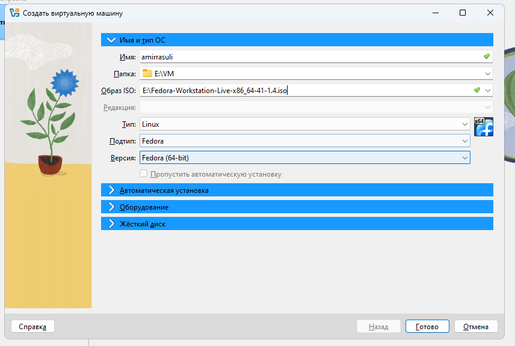
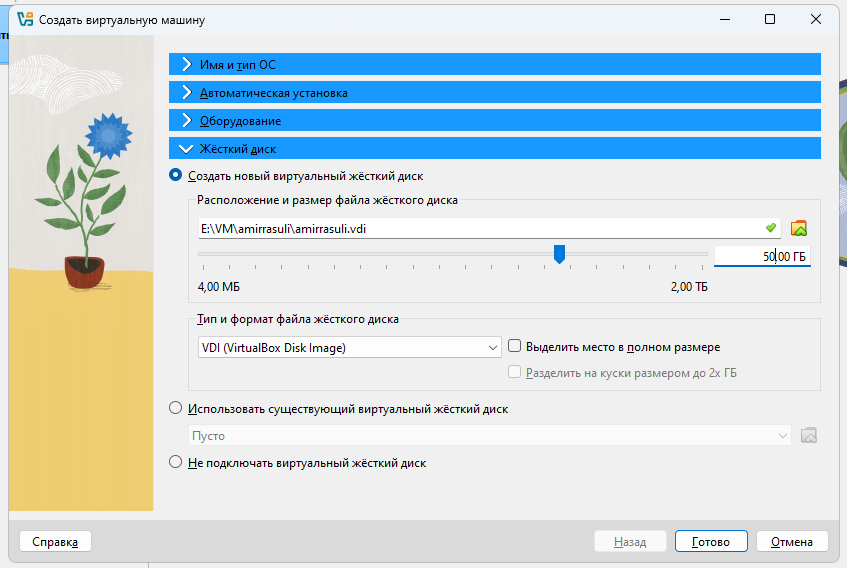
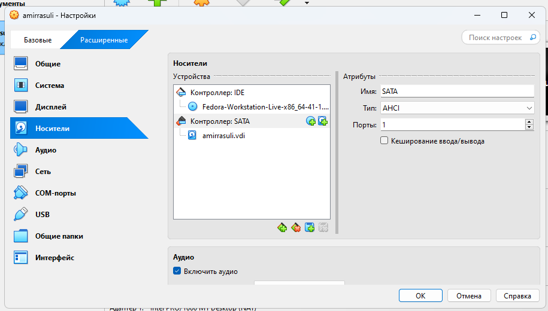
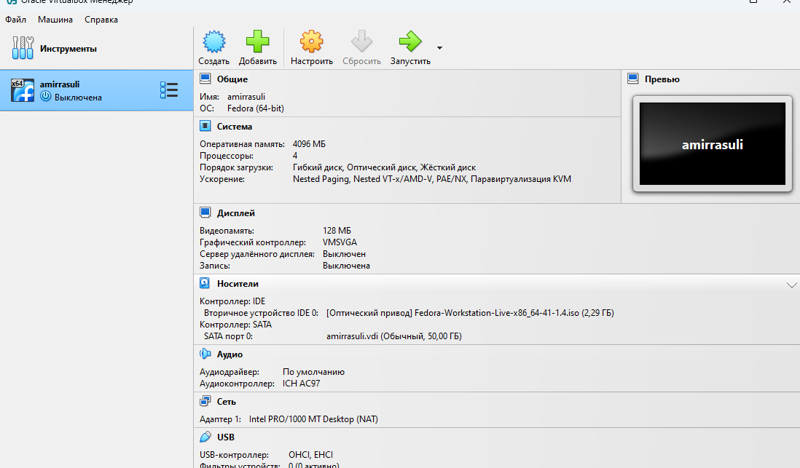
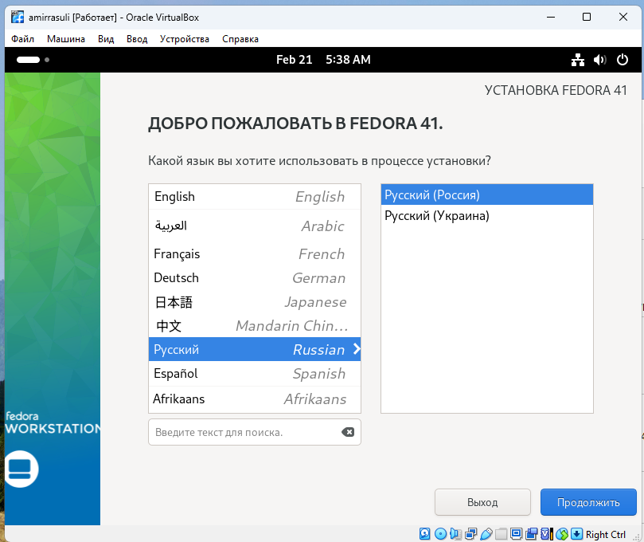
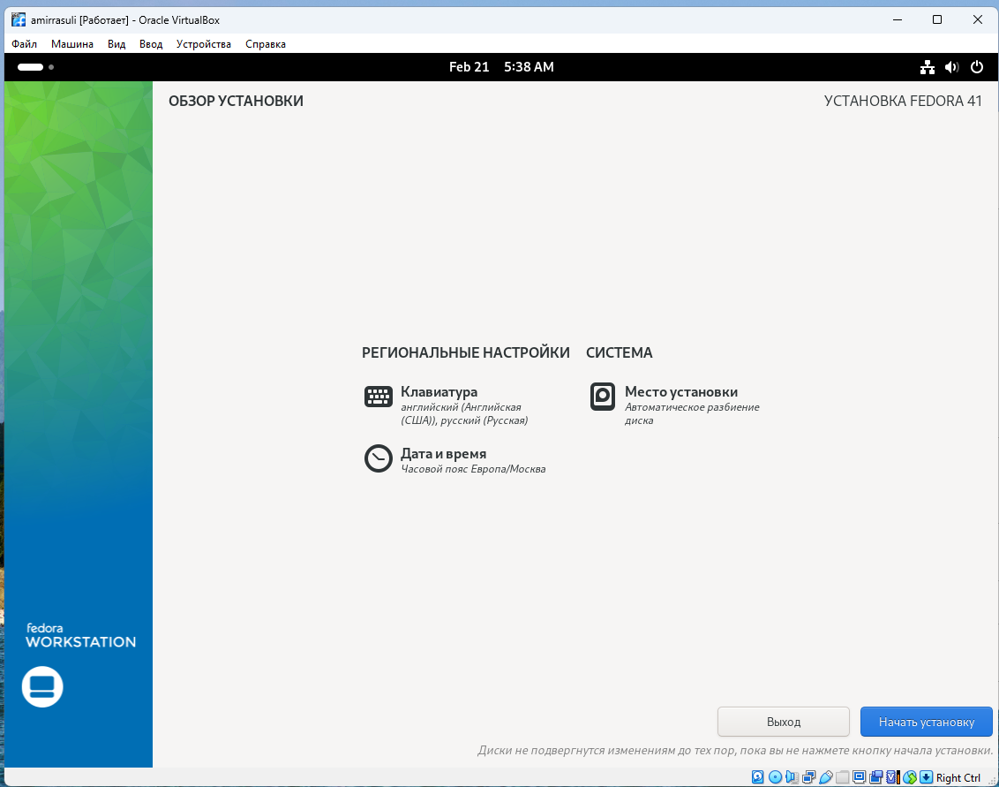
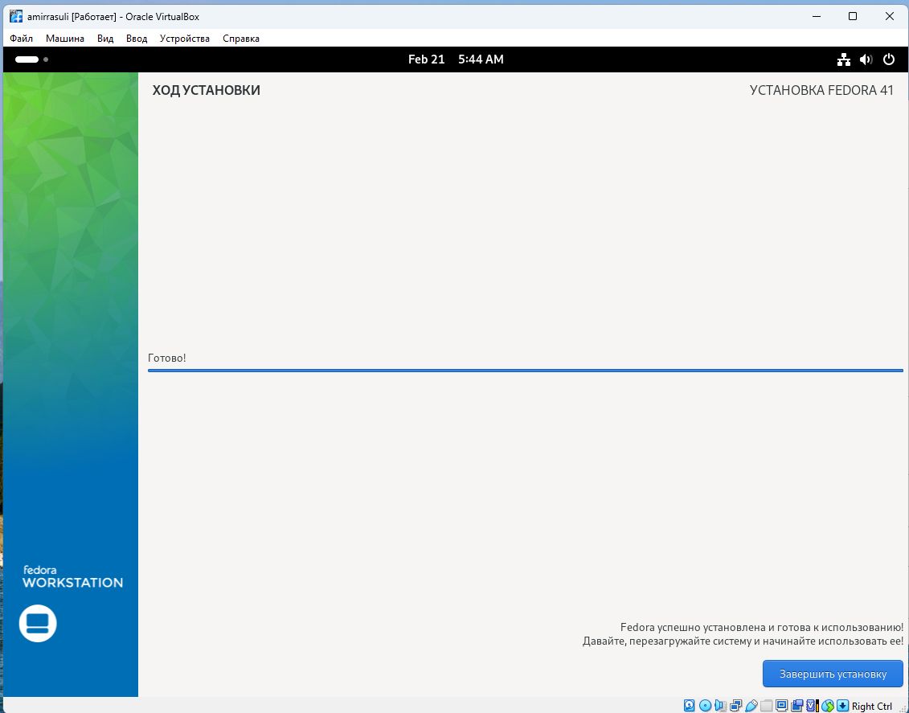
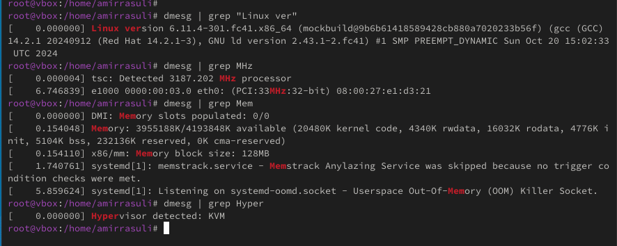
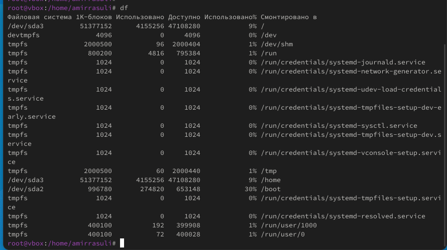

---
## Front matter
title: "Отчёт по лабораторной работе №1"
subtitle: "Установка ОС"
author: "Амир Расули"

## Generic otions
lang: ru-RU
toc-title: "Содержание"

## Bibliography
bibliography: bib/cite.bib
csl: pandoc/csl/gost-r-7-0-5-2008-numeric.csl

## Pdf output format
toc: true # Table of contents
toc-depth: 2
lof: true # List of figures
lot: true # List of tables
fontsize: 12pt
linestretch: 1.5
papersize: a4
documentclass: scrreprt
## I18n polyglossia
polyglossia-lang:
  name: russian
  options:
	- spelling=modern
	- babelshorthands=true
polyglossia-otherlangs:
  name: english
## I18n babel
babel-lang: russian
babel-otherlangs: english
## Fonts
mainfont: IBM Plex Serif
romanfont: IBM Plex Serif
sansfont: IBM Plex Sans
monofont: IBM Plex Mono
mathfont: STIX Two Math
mainfontoptions: Ligatures=Common,Ligatures=TeX,Scale=0.94
romanfontoptions: Ligatures=Common,Ligatures=TeX,Scale=0.94
sansfontoptions: Ligatures=Common,Ligatures=TeX,Scale=MatchLowercase,Scale=0.94
monofontoptions: Scale=MatchLowercase,Scale=0.94,FakeStretch=0.9
mathfontoptions:
## Biblatex
biblatex: true
biblio-style: "gost-numeric"
biblatexoptions:
  - parentracker=true
  - backend=biber
  - hyperref=auto
  - language=auto
  - autolang=other*
  - citestyle=gost-numeric
## Pandoc-crossref LaTeX customization
figureTitle: "Рис."
tableTitle: "Таблица"
listingTitle: "Листинг"
lofTitle: "Список иллюстраций"
lotTitle: "Список таблиц"
lolTitle: "Листинги"
## Misc options
indent: true
header-includes:
  - \usepackage{indentfirst}
  - \usepackage{float} # keep figures where there are in the text
  - \floatplacement{figure}{H} # keep figures where there are in the text
---

# Цель работы

Целью данной работы является приобретение практических навыков установки операционной системы на виртуальную машину, настройки минимально необходимых для дальнейшей работы сервисов

# Выполнение лабораторной работы

Создаю виртуальную машину

{ #fig:001 width=70% height=70% }

Задаю конфигурацию жёсткого диска — VDI, динамический виртуальный диск.

{ #fig:002 width=70% height=70% }

{ #fig:003 width=70% height=70% }

Добавляю новый привод оптических дисков и выбираю образ 

{ #fig:004 width=70% height=70% }

Запускаю виртуальную машину и выбираю установку системы на жёсткий диск.
Устанавливаю язык для интерфейса и раскладки клавиатуры

{ #fig:005 width=70% height=70% }

Указываю параметры установки

{ #fig:006 width=70% height=70% }

{ #fig:007 width=70% height=70% }

Создаю пользователя

{ #fig:008 width=70% height=70% }
 
Захожу в созданную учётную запись. 

Информация по машине.

1. Версия ядра Linux (Linux version).

2. Частота процессора (Detected Mhz processor).

3. Модель процессора (CPU0).

4. Объем доступной оперативной памяти (Memory available).

5. Тип обнаруженного гипервизора (Hypervisor detected).

{ #fig:009 width=70% height=70% }

6. Тип файловой системы корневого раздела.
7. Последовательность монтирования файловых систем

{ #fig:010 width=70% height=70% }

# Вывод

Мы приобрели практические навыки установки операционной системы на виртуальную машину, настройки минимально необходимых для дальнейшей работы сервисов.

# Контрольные вопросы

1. Какую информацию содержит учётная запись пользователя?

* входное имя пользователя (Login Name);
* пароль (Password);
* внутренний идентификатор пользователя (User ID);
* идентификатор группы (Group ID);
* анкетные данные пользователя (General Information);
* домашний каталог (Home Dir);
* указатель на программную оболочку (Shell).

2. Укажите команды терминала и приведите примеры:

* для получения справки по команде - man;
* для перемещения по файловой системе - cd;
* для просмотра содержимого каталога - ls;
* для определения объёма каталога - ls -l;
* для создания / удаления каталогов / файлов - touch, mkdir, rm, rmdir;
* для задания определённых прав на файл / каталог - chmod;
* для просмотра истории команд - history.

3. Что такое файловая система? Приведите примеры с краткой характеристикой.

Файловая система (англ. file system) — порядок, определяющий способ организации, хранения и именования данных на носителях информации в компьютерах, а также в другом электронном оборудовании.

FAT. Числа в FAT12, FAT16 и FAT32 обозначают количество бит, используемых для перечисления блока файловой системы. FAT32 является фактическим стандартом и устанавливается на большинстве видов сменных носителей по умолчанию. Одной из особенностей этой версии ФС является возможность применения не только на современных моделях компьютеров, но и в устаревших устройствах и консолях, снабженных разъемом USB.
Пространство FAT32 логически разделено на три сопредельные области: зарезервированный сектор для служебных структур; табличная форма указателей; непосредственная зона записи содержимого файлов. 

Стандарт NTFS разработан с целью устранения недостатков, присущих более ранним версиям ФС. Впервые он был реализован в Windows NT в 1995 году, и в настоящее время является основной файловой системой для Windows. Система NTFS расширила допустимый предел размера файлов до шестнадцати гигабайт, поддерживает разделы диска до 16 Эб (эксабайт, 1018 байт). Использование системы шифрования Encryption File System (метод «прозрачного шифрования») осуществляет разграничение доступа к данным для различных пользователей, предотвращает несанкционированный доступ к содержимому файла. Файловая система позволяет использовать расширенные имена файлов, включая поддержку многоязычности в стандарте юникода UTF, в том числе в формате кириллицы. Встроенное приложение проверки жесткого диска или внешнего накопителя на ошибки файловой системы chkdsk повышает надежность работы харда, но отрицательно влияет на производительность.

Ext2, Ext3, Ext4 или Extended Filesystem– стандартная файловая система, первоначально разработанная еще для Minix. Содержит максимальное количество функций и является наиболее стабильной в связи с редкими изменениями кодовой базы. Начиная с ext3 в системе используется функция журналирования. Сегодня версия ext4 присутствует во всех дистрибутивах Linux. 

XFS рассчитана на файлы большого размера, поддерживает диски до 2 терабайт. Преимуществом системы является высокая скорость работы с большими файлами, отложенное выделение места, увеличение разделов на лету, незначительный размер служебной информации. К недостаткам относится невозможность уменьшения размера, сложность восстановления данных и риск потери файлов при аварийном отключении питания.

4. Как посмотреть, какие файловые системы подмонтированы в ОС?

командой du.

5. Как удалить зависший процесс?

командой kill.